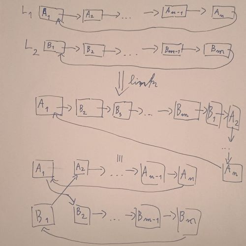
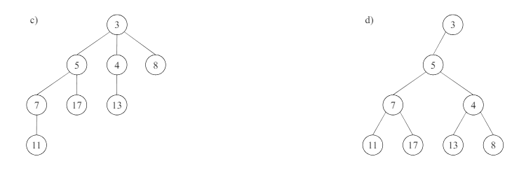
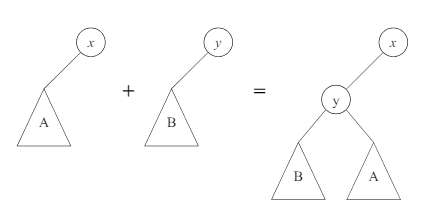
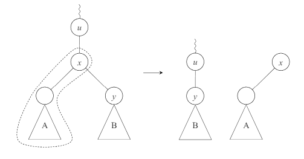
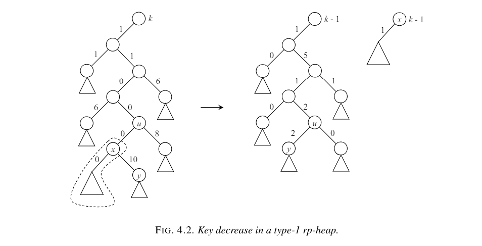

# Rank-Pairing Heap

Contains implementation of rank pairing heap (rp heap) of type 1.

Written in C++ (C++11).

## Abstract

A heap is a data structure where you can store and find the minimum (or maximum) element in an array instantly, 
allowing insertion, merging, deleting minimum, decreasing a key in a complexity generally around O(log n). 

A [rank-pairing heap](https://oar.princeton.edu/bitstream/88435/pr1j53c/1/RankPairingHeaps.pdf) is a implementation 
proposed by *BERNHARD HAEUPLER, SIDDHARTHA SEN AND ROBERT E. TARJAN*, promising a simple code to achieve the best complexity, 
of O(1) for all but extract_min (which is O(log n) amortized).

The complexity is the best possible, equalling the likes of Fibonacci heap (which is good in theory but not that good in practice) 
and also fares well in practice.

## RP-heap ideas 

### Prerequisites

A **simply-linked circular list** allows O(1) access to the first element (any chosen element), adding element and linking 2 of the type.

The linking(catenation) ocurrs as such: link the first element to the second in both lists.

A **half-tree** is a type of binary tree respecting half of the ususal binary heap property: the left descendants are all smaller than the current node and, in addition, the root only has a left child. Such an implementation is actually equivalent to a n-ary heap where siblings become right children of eachother with the left being their children.

Such a structure is useful, since it is a binary tree and allows easy linkage and cutting.

> Linkage is done by setting the smaller half-tree's left tree as the right tree of the bigger one (it doesn't need to respect the heap condtion and also doesn't have a right subtree), then simply making the bigger half-tree as the left child of the smaller one.

> Cutting of a node is done by swapping it's right tree in its place (if the cut node was a left child it's right spine was smaller than the parent and if it was a right child it doesn't matter) and then the cut part is a half-tree.

A **one-pass** "binomial queue" is a lazy linkage: iterating a list of items with a set rank attribute, add each one to a its rank. If 2 of the same rank, link them and add them to a result, leaving the bucket empty. At the end add the non-empty buckets to the result and then you have the final result.

### the Rank-pairing heap

The RP-heap is a saved as a simply-linked circular list of half-trees. The first element will be the root with the minimum value.

1. *find_min()* => return the value at the first element. O(1)
2. *insert(x)* => link a new element into the list of root. Make it first element if it is smaller than the older minimum. O(1)
3. *meld(H)* => link the list of roots. Change first element if necessary. O(1)

these were the trivial operations. Now for the more interesting:

4. *delete_min()* => going right through the first element's left spine (the siblings of a n-ary heap), cut them and add them to the list of roots.
This might not be O(1) so we might as well do some cleaning. *One-pass* the root list and you'll also be able to find the new minimum. The complexity is O(n) worst-case, but O(log n) amortized (on average).

Wait a second, what is a **rank**? We can choose it to mean this: a node that doesn't exist (a null) has a rank of -1. A leaf has a rank of 0. A node in a binary tree has a rank of 1 + max(left_child, right_child). In our case, two half-trees of rank k will produce one with rank k+1 which would be perfect (also a perfect power of 2 like binomial queues).

Actually, since we want to support cutting, it's going to become a little bit more complex: the rank is 1 + max as above is the children have equal rank. But if they don't, it has to be max (without +1). We like difference of the type 1-1, or 0-i with i being any number since it doesn't affect us.

5. *key decrease* => the reason for rp-heaps instead of pairing is that the key decreased can be done in O(1) amortized time. The reason it's O(1) is based on some math I don't want to try to explain. The idea of the key decrease is to not try to make any restructuring (like the other O(1) heaps) and to just cut the node and add it to the list of roots. This would have been a clear O(1) but we also need to update the rank of the parents of the cut node. We use the rule described above for keeping the rank and we update up until we don't decrease the rank anymore or reach a root. On average, we shouldn't have to climb too much.

6. *delete key* => simply make its value -infinity and extract min. O(log n).

